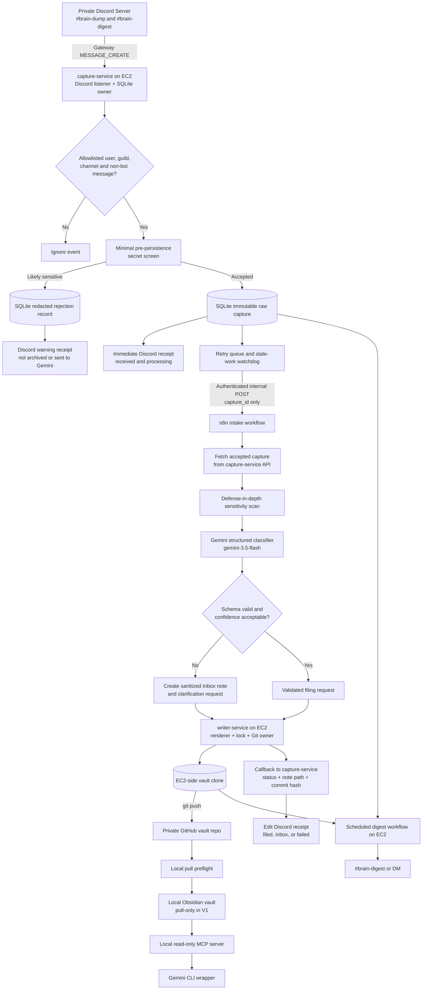
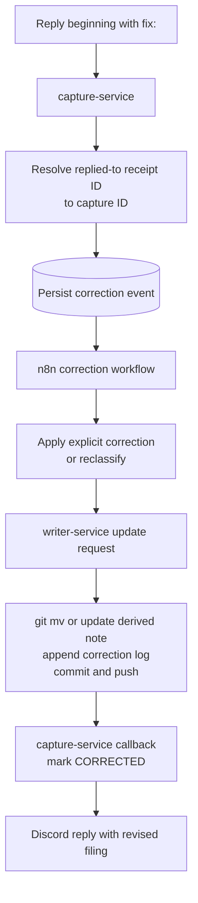

# Second Brain — Canonical Architecture & Build Plan

**Status:** Approved design, pre-build  
**Last updated:** 2026-06-07  
**Revision:** Runtime-hardening pass: Docker egress, SQLite write serialization, lease reaper, OS advisory Git lock, correction targeting, and digest labeling.  
**Canonical document:** This file is the source of truth for implementation.  
**Application repository:** `yeevon/second-brain`  
**Vault repository:** private Git repository  
**Classifier model:** `gemini-3.5-flash` pinned to the stable model string; never use a floating `latest` alias.

---

## 1. Purpose

This system provides a low-friction personal Second Brain:

```text
capture a thought in Discord from any device
    ↓
receive an immediate durable-capture receipt
    ↓
classify and file the note automatically
    ↓
review the Markdown vault locally in Obsidian
    ↓
query the local vault through a read-only MCP server
    ↓
correct filing errors by replying "fix: ..."
```

The system is designed around one non-negotiable requirement:

> A note must be durably captured and acknowledged immediately, even if n8n, Gemini, GitHub, or the local PC is temporarily unavailable.

Classification is useful. Capture durability is mandatory.

---

## 2. Scope

## 2.1 Version-one goals

- Provide one capture surface across mobile, laptop, and desktop.
- Acknowledge each accepted Discord message within a few seconds.
- Persist an accepted raw capture before any downstream network call.
- Prevent duplicate notes during retries, reconnects, and restart catch-up.
- Detect likely secrets before persisting or sending content to Gemini.
- Classify notes with one structured Gemini call.
- Render Markdown deterministically outside the LLM.
- Preserve traceability from Discord message to raw capture, derived note, Git commit, and correction history.
- File uncertain notes into `00_inbox/` rather than silently force-fitting them.
- Serialize all automated Git writes.
- Sync the remote vault into local Obsidian in pull-only mode.
- Run daily and weekly digest workflows from EC2.
- Expose local search through a narrow, read-only MCP server.
- Fail visibly and retry safely.

## 2.2 Explicit non-goals for version one

Version one will not include:

- Vector databases or embeddings.
- A separate Bouncer LLM call.
- Writable MCP tools.
- Automatic attachment archiving.
- Complex two-way Obsidian sync.
- Redis, Kafka, or a distributed queue.
- Automatic prompt tuning from corrections.
- A custom mobile or web application.
- Automatic secret storage.
- A raw-message mirror inside the Git vault.

---

## 3. Settled architecture decisions

These are design decisions, not open questions.

| Decision | Chosen approach | Reason |
|---|---|---|
| Discord ingestion | Persistent Discord Gateway connection listening for `MESSAGE_CREATE` | A normal guild-channel message does not arrive at an arbitrary n8n webhook by itself. |
| Durable intake boundary | `capture-service` persists before calling n8n | A note must remain safe when n8n is unavailable. |
| SQLite ownership | Only `capture-service` opens the SQLite database | Avoid shared-file ambiguity across containers. |
| Raw accepted message storage | SQLite ledger only | Avoid unnecessary duplication of raw personal data into Git. |
| Sensitive-message storage | Save a redacted rejection record only | Do not create a plaintext credential archive. |
| LLM calls per note | One Gemini classifier call | Lower latency and fewer prompts to maintain. |
| LLM output | JSON only | The model never chooses paths, filenames, or final Markdown. |
| Vault write ownership | `writer-service` only | One service owns the Git credential, vault clone, renderer, and write lock. |
| Git strategy | EC2-side clone + OS advisory `flock` + fast-forward-only sync | A real kernel-managed lock serializes Git mutation and is released when the owning file descriptor closes. Do not use a naive lock-file-exists sentinel. |
| Local Obsidian | Pull-only in version one | Avoid two-writer merge conflicts until a deliberate conflict strategy exists. |
| Restart recovery | Mandatory catch-up scan plus retry queue | Missing a capture defeats the system's purpose. |
| Attachment handling | Detect and warn; do not archive binaries in version one | Avoid silent loss without expanding the first milestone. |
| GitHub role | Remote Git replica, not queue, ledger, or only backup | Keep responsibilities explicit. |
| MCP role | Local, narrow, and read-only | Limit stale reads, path traversal, prompt injection, and accidental mutation. |

---

## 4. Audit findings

## 4.1 What was right in the original concept

| Original choice | Verdict | Why it stays |
|---|---|---|
| Discord as the capture surface | Keep | It is already available across devices, supports replies and threads, and removes the need for a custom app. |
| n8n as orchestrator | Keep | It is a good fit for branching, external API calls, retries, error workflows, and scheduled digests. |
| Gemini Flash for classification | Keep | A pinned stable Flash model is appropriate for structured low-latency classification. |
| Markdown vault | Keep | Markdown is portable, inspectable, greppable, and versionable. |
| Private Git repository | Keep with narrower responsibility | It is a useful remote Git replica and sync layer. |
| Obsidian | Keep | It provides a strong local human interface without UI development. |
| Immediate receipts | Keep and strengthen | The user needs near-real-time audit feedback. |
| Clarification and `fix:` correction loops | Keep | They preserve trust and create prompt-tuning evidence. |
| Daily and weekly review loops | Keep | They turn capture into a working review system. |
| MCP query layer | Keep, but read-only | It enables local query access after the intake spine is stable. |

## 4.2 Problems fixed by this architecture

### Incorrect Discord-to-n8n edge

Discord clients do not directly POST ordinary channel messages to an arbitrary n8n webhook. The corrected design adds a Gateway-connected `capture-service`.

### Raw capture was not guaranteed before classification

Calling n8n or Gemini before persisting the event allows silent note loss. The corrected design makes `capture-service` persist first and forward second.

### n8n and the listener did not have a clean SQLite contract

The corrected design makes `capture-service` the sole SQLite owner. n8n reads and updates capture state through an internal authenticated API.

### The LLM had too much filesystem control

The corrected design allows Gemini to return structured JSON only. `writer-service` validates, sanitizes, renders, and writes files deterministically.

### GitHub was overloaded with responsibilities

The corrected design treats GitHub as a remote Git replica only. SQLite owns processing state. Separate encrypted backups protect the ledger, EC2 clone, and n8n state.

### Git write concurrency was undefined

The corrected design uses one locked `writer-service`. Optional n8n execution limits are defense-in-depth, not the correctness mechanism.

### Local Obsidian editing would create two writers

The corrected version-one rule is pull-only local sync. Manual corrections go through the Discord `fix:` workflow.

### Sensitive-data handling started too late

The corrected design adds a minimal secret screen inside `capture-service` before persistence, plus a second defense-in-depth scan in n8n before Gemini.

### Restart catch-up was treated as optional

The corrected design makes catch-up mandatory. The bot must have permission to read message history.

### The EC2-side vault clone was not explicit enough

The corrected design makes `writer-service` operate on an EC2-side clone, then push to GitHub. Scheduled digests read the EC2-side clone and ledger, never the local desktop vault.

---

## 5. Design invariants

These rules must remain true as implementation evolves.

1. **Persist before downstream processing.**
2. **Sensitive input is rejected before plaintext persistence.**
3. **The original accepted Discord capture is immutable.**
4. **Derived Markdown may be updated or superseded without rewriting the raw capture.**
5. **The Discord message ID is the idempotency key.**
6. **A retry must not create a duplicate Markdown note.**
7. **The model returns data, never file paths or final Markdown.**
8. **Only `capture-service` accesses SQLite directly.**
9. **Only `writer-service` mutates the EC2 vault clone or pushes Git commits.**
10. **Git writes are serialized with a real writer lock.**
11. **Low-confidence notes land in `00_inbox/`.**
12. **Clarification delays filing, not capture.**
13. **GitHub is not the ledger and not the only backup.**
14. **Local Obsidian is pull-only in version one.**
15. **MCP is local and read-only in version one.**
16. **Any failed capture remains visible and retryable.**
17. **Every stored derived note is traceable back to one capture ID.**
18. **Every correction appends history rather than erasing history.**
19. **SQLite mutations are serialized inside `capture-service`; no network call occurs while a database write transaction is open.**
20. **The stale-lease reaper is single-flight and bounded; it never overlaps itself or retries forever.**
21. **Internal container ports are not published to the EC2 host. Services retain normal outbound internet access.**

---

## 6. Target architecture



---

## 7. Trust boundaries and credential placement

Keep credentials as narrow as practical.

| Component | Credentials it may hold | Credentials it must not hold |
|---|---|---|
| `capture-service` | Discord bot token, internal API secret | Gemini API key, GitHub write credential |
| n8n | Gemini API key, internal service secrets, n8n encryption key | Discord bot token when receipt actions are proxied through `capture-service`; GitHub write credential when writes are proxied through `writer-service` |
| `writer-service` | Repository-scoped Git write credential, internal API secret | Discord bot token, Gemini API key |
| Local MCP server | Local vault path only | GitHub write credential, Discord token, Gemini cloud credential unless separately required by local CLI |
| Obsidian | Local read-only clone credentials as needed | EC2 service credentials |

Preferred Git authentication for `writer-service`:

```text
repository-scoped SSH deploy key with write access
```

Acceptable fallback:

```text
fine-grained GitHub token scoped only to the private vault repository with minimum required Contents permissions
```

---

## 8. Component responsibilities

## 8.1 Private Discord server

### Required channels

```text
#brain-dump
#brain-digest
```

### Required bot permissions

```text
View Channel
Send Messages
Read Message History
Create Public Threads          # only if clarification threads are used
Send Messages in Threads       # only if clarification threads are used
```

### Responsibilities

- Provide the single user-facing capture surface.
- Preserve the original Discord message.
- Display immediate and final receipts.
- Accept `fix:` replies.
- Host clarification replies or threads.
- Display digest output and failure alerts.

### Supported capture examples

```text
Review WebSocket reconnect handling in the HALO telemetry dashboard.
```

```text
task: Finish EC2 Discord listener service file.
```

```text
done: Added immutable raw capture persistence.
```

```text
decision: Keep local Obsidian pull-only for version one.
```

```text
fix: file this under Learning, not Projects.
```

---

## 8.2 `capture-service`

### Purpose

`capture-service` is the durable intake boundary. It owns the Discord Gateway connection, the SQLite ledger, receipts, retry delivery, catch-up, and the internal state API.

### Runtime

Run continuously on EC2 under Docker Compose restart policies or `systemd`.

### Responsibilities

- Connect to the Discord Gateway.
- Subscribe to `MESSAGE_CREATE`.
- Enable required intents, including message content access.
- Accept only configured Discord user IDs, guild ID, and channel IDs.
- Ignore bot-authored and webhook-authored messages.
- Detect `fix:` replies separately.
- Detect attachment presence and metadata.
- Run a minimal secret screen before persistence.
- Assign a stable human-facing capture ID.
- Persist accepted raw captures to SQLite before any downstream network call.
- Persist only a redacted rejection record for likely-sensitive messages.
- Send immediate Discord receipts after persistence.
- Forward accepted `capture_id` values to n8n through a private authenticated webhook.
- Serialize all SQLite mutations through one in-process write queue or dedicated database executor.
- Keep database write transactions short; never hold a transaction open across an HTTP request, Discord API call, or other network operation.
- Retry transient `SQLITE_BUSY` failures locally with bounded backoff before reporting a capture failure.
- Retry unsent and stale captures with capped exponential backoff.
- Run a single-flight stale-processing-lease reaper inside `capture-service`.
- Run mandatory startup catch-up against Discord message history.
- Expose internal authenticated API endpoints for n8n and `writer-service`.
- Maintain health and status endpoints.

### Required input filters

```text
allow configured user IDs only
allow configured guild ID only
allow configured capture channel IDs only
ignore bot-authored messages
ignore webhook-authored messages
route reply messages beginning with "fix:" separately
detect messages with attachments
```

### Correction target resolution

A correction is accepted only when the target capture is unambiguous.

Supported forms:

```text
reply directly to a filing receipt:
fix: file this under Learning

or include the capture ID explicitly:
fix SB-20260607-0042: file this under Learning
```

A standalone ambiguous message such as:

```text
fix: file this under Learning
```

must be rejected visibly when it is not a reply. Do not guess the most-recent capture.

Response:

```text
⚠️ I could not identify which capture to update.
Reply directly to the filing receipt with:
fix: <correction>

Or include the capture ID:
fix SB-20260607-0042: <correction>
```

Append a `CORRECTION_REJECTED_MISSING_TARGET` audit event. Do not create a correction row until a valid target is resolved.

### Mandatory restart catch-up

On startup:

1. Read the last successfully observed Discord message ID from SQLite.
2. Fetch newer `#brain-dump` messages from Discord history.
3. Insert missing message IDs idempotently.
4. Send immediate receipts for newly recovered messages.
5. Forward accepted, unprocessed captures.
6. Continue normal Gateway processing.

A bounded recent-history reconciliation scan should also run periodically as a safety net.

### Stale-processing-lease reaper

The lease watchdog runs inside `capture-service`, because `capture-service` owns SQLite and retry state.

Implementation rules:

```text
self-scheduling loop, not an overlapping timer
    ↓
wait until previous pass finishes
    ↓
open short SQLite transaction
    ↓
claim expired FORWARDED or CLASSIFYING rows conditionally
increment retry_attempts (shared counter across both failure paths)
clear expired lease
calculate next_attempt_at using capped exponential backoff
append REQUEUED_STALE_LEASE event
    ↓
if retry cap exceeded:
    mark FAILED
    append RETRY_LIMIT_EXCEEDED event
    queue Discord failure alert
    ↓
commit transaction
    ↓
perform Discord alert calls outside the transaction
    ↓
sleep 30–60 seconds
```

The reaper must never use a naive `setInterval` loop that can start a second pass before the first pass finishes. It must also never retry a permanently stuck capture forever.

#### Retry counters

Two independent counters track delivery history:

| Counter | Meaning | When incremented |
| --- | --- | --- |
| `delivery_attempts` | Number of times the dispatcher claimed a delivery generation | On every successful `claim_due_deliveries` |
| `retry_attempts` | Accumulated retry events across both failure paths | On every `schedule_retry` (webhook failure) or stale-lease reap |

`retry_attempts` is the authoritative counter for cap checks and backoff calculations. Both the webhook-failure path and the stale-lease reaper increment the same counter so that mixed failure modes reach one consistent cap.

Example: one webhook failure followed by one stale-lease reap produces `retry_attempts == 2`, regardless of how many `delivery_attempts` exist.

#### Startup independence from Discord connectivity

The reaper watchdog is a SQLite-only background loop. It must start at `capture-service` initialization, not inside the Discord `on_ready` callback.

Correct startup sequence:

```text
CaptureService opens SQLite
    ↓
capture-service API starts
    ↓
stale-lease reaper task created (ensure_stale_lease_reaper_task)
    ↓
Discord client starts (may connect, fail, or reconnect)
    ↓
on_ready fires (eventually or never)
    ↓
startup reconciliation runs inside on_ready callback
    ↓
ensure_stale_lease_reaper_task called again as a dead-task restart guard
```

The reaper must keep running if:

- Discord is unavailable at startup
- `on_ready` never fires
- Startup reconciliation raises an exception

Discord receipt edits (after requeue or terminal failure) are always best-effort: they happen outside the SQLite transaction and after the transaction commits. A receipt-edit failure must not roll back, abort, or prevent the reaper from continuing.

#### Manual retry CLI

Operators can manually re-queue a terminally failed capture:

```bash
secondbrain retry SB-YYYYMMDD-NNNN
```

Exit codes:

- `0` — retry was queued; capture moved from `FAILED` to `RETRY_WAIT`
- `1` — rejected; either the capture ID does not exist or the capture is not in terminal `FAILED` state

Rejection messages go to `stderr`. The queued confirmation goes to `stdout`.

Metadata log events emitted:

- `manual_retry_requested` — capture was successfully re-queued
- `manual_retry_rejected` with `reason=capture_not_found` or `reason=invalid_state`

The manual retry resets `retry_attempts` to zero so the capture gets a full fresh retry budget.

### Internal API

Bind this API to localhost or the private Docker network only.

```text
GET  /health
GET  /internal/captures/:capture_id
POST /internal/captures/:capture_id/mark-forwarded
POST /internal/captures/:capture_id/mark-classifying
POST /internal/captures/:capture_id/mark-filed
POST /internal/captures/:capture_id/mark-inbox
POST /internal/captures/:capture_id/mark-failed
POST /internal/captures/:capture_id/mark-corrected
POST /internal/captures/:capture_id/retry
POST /internal/receipts/:capture_id/edit
POST /internal/clarifications/:capture_id
```

All state-changing endpoints require an internal shared-secret header.

### Capture IDs

Human-facing receipt ID:

```text
SB-YYYYMMDD-NNNN
```

System idempotency key:

```text
Discord message snowflake ID
```

The SQLite transaction that creates a capture must guarantee uniqueness.

---

## 8.3 SQLite capture ledger

### Ownership

Only `capture-service` opens the SQLite database directly.

n8n and `writer-service` use the `capture-service` internal API. They do not mount or modify the SQLite file.

### Recommended mode

```text
WAL mode
foreign_keys = ON
busy_timeout configured on every SQLite connection
fixed SQLite runtime version
```

### SQLite runtime version

Because this design depends on WAL mode, pin a SQLite build containing the WAL-reset fix:

```text
preferred: SQLite 3.51.3 or later
acceptable backports: 3.50.7 or 3.44.6
```

Do not silently inherit an older SQLite library from a base image without checking its version.

### Storage rules

- Store raw plaintext only for accepted captures.
- Do not overwrite `raw_text`.
- Store a redacted record only for rejected likely-sensitive content.
- Keep processing status separate from note lifecycle status.
- Append all meaningful state transitions to `capture_events`.
- Preserve correction history.
- Serialize all mutations through one `capture-service` database write queue or dedicated executor.
- Keep write transactions short and free of network calls.
- Treat `SQLITE_BUSY` as a recoverable local contention error with bounded retries.

### Core schema

```sql
CREATE TABLE captures (
    capture_id TEXT PRIMARY KEY,
    discord_message_id TEXT NOT NULL UNIQUE,
    discord_channel_id TEXT NOT NULL,
    discord_guild_id TEXT NOT NULL,
    discord_author_id TEXT NOT NULL,
    parent_message_id TEXT,
    receipt_message_id TEXT,

    raw_text TEXT,
    redacted_text TEXT,
    is_sensitive INTEGER NOT NULL DEFAULT 0,
    sensitivity_flags TEXT,

    has_attachments INTEGER NOT NULL DEFAULT 0,
    attachment_count INTEGER NOT NULL DEFAULT 0,
    attachment_metadata_json TEXT,

    received_at TEXT NOT NULL,
    status TEXT NOT NULL,
    derived_note_path TEXT,
    git_commit_hash TEXT,
    classification_json TEXT,

    delivery_attempts INTEGER NOT NULL DEFAULT 0,
    processing_lease_until TEXT,
    next_attempt_at TEXT,
    last_error TEXT,
    updated_at TEXT NOT NULL,

    CHECK (
        (is_sensitive = 0 AND raw_text IS NOT NULL)
        OR
        (is_sensitive = 1 AND raw_text IS NULL AND redacted_text IS NOT NULL)
    )
);

CREATE TABLE capture_events (
    id INTEGER PRIMARY KEY AUTOINCREMENT,
    capture_id TEXT NOT NULL,
    event_type TEXT NOT NULL,
    event_payload_json TEXT,
    created_at TEXT NOT NULL,
    FOREIGN KEY (capture_id) REFERENCES captures(capture_id)
);

CREATE TABLE corrections (
    id INTEGER PRIMARY KEY AUTOINCREMENT,
    capture_id TEXT NOT NULL,
    discord_message_id TEXT NOT NULL UNIQUE,
    correction_text TEXT NOT NULL,
    created_at TEXT NOT NULL,
    applied_at TEXT,
    status TEXT NOT NULL,
    old_note_path TEXT,
    new_note_path TEXT,
    git_commit_hash TEXT,
    last_error TEXT,
    FOREIGN KEY (capture_id) REFERENCES captures(capture_id)
);

CREATE TABLE system_state (
    key TEXT PRIMARY KEY,
    value TEXT NOT NULL,
    updated_at TEXT NOT NULL
);

CREATE INDEX idx_captures_status_next_attempt
    ON captures(status, next_attempt_at);

CREATE INDEX idx_capture_events_capture_id
    ON capture_events(capture_id);

CREATE INDEX idx_corrections_capture_id
    ON corrections(capture_id);
```

### Processing statuses

```text
RECEIVED
FORWARDED
CLASSIFYING
NEEDS_CLARIFICATION
FILED
CORRECTED
REJECTED_SENSITIVE
FAILED
```

### Lease and retry behavior

A successful webhook acceptance does not prove the downstream workflow finished.

`capture-service` must:

- Mark forwarded or classifying work with a processing lease.
- Expect a terminal callback such as `FILED`, `NEEDS_CLARIFICATION`, `CORRECTED`, or `FAILED`.
- Requeue work whose lease expires without a terminal callback.
- Use capped exponential backoff.
- When the retry cap is exceeded, transition the capture to `FAILED`, append an audit event, and send a Discord alert.
- Preserve idempotency during repeated processing.

This protects against a crash after n8n accepts the webhook but before it finishes the workflow.

### SQLite write-serialization rule

WAL mode allows readers and a writer to proceed concurrently, but SQLite still permits only one writer at a time. `capture-service` must make that limitation explicit.

Use one of these equivalent implementation patterns:

```text
Node.js:
    one database connection
    one repository layer
    serialized write queue
    no await inside write transactions

Python:
    one dedicated database worker
    queued mutation commands
    short transactions
    no network I/O inside the worker transaction
```

#### Python implementation — `SQLiteRuntime`

`capture-service` implements this through a dedicated `SQLiteRuntime` worker:

```text
Discord handler / classifier worker / status command
    ↓
Ledger repository method
    ↓
SQLiteRuntime.write(operation) or SQLiteRuntime.read(operation)
    ↓
bounded job queue (Queue(maxsize=SQLITE_JOB_QUEUE_MAXSIZE))
    ↓
single SQLite worker thread
    ↓
single worker-owned SQLite connection (WAL, foreign_keys=ON, busy_timeout configured)
```

**Invariant:** A saved receipt is sent only after the insert transaction commits and the row is externally visible from a separate SQLite connection.

**Invariant:** No Discord call, Gemini call, or network request of any kind is made while a database write transaction is open.

If an operation encounters `SQLITE_BUSY` or `SQLITE_LOCKED`, it retries with bounded exponential backoff (configurable via `SQLITE_BUSY_RETRY_ATTEMPTS` and `SQLITE_BUSY_RETRY_BASE_DELAY_MS`). After the retry budget is exhausted, `SQLiteBusyError` is raised — the service does not claim the note was saved.

Startup sequence:
```text
SQLiteRuntime starts worker thread
    ↓
worker thread creates connection with WAL + foreign_keys + busy_timeout
    ↓
worker thread verifies PRAGMAs
    ↓
worker thread runs versioned migrations
    ↓
runtime signals ready
    ↓
Discord listener starts accepting messages
```

Migration sequence:
```text
create schema_migrations table (IF NOT EXISTS)
    ↓
read applied version numbers
    ↓
apply missing migrations in ascending order
    ↓
record each completed version
    ↓
accept normal jobs
```

For every database connection:

```sql
PRAGMA journal_mode = WAL;
PRAGMA foreign_keys = ON;
PRAGMA busy_timeout = 5000;
```

When an insert still encounters `SQLITE_BUSY`:

```text
retry locally with bounded jittered backoff
    ↓
commit before sending the saved receipt
    ↓
if retries fail:
    do not claim the note was saved
    send a visible failure warning when possible
    rely on mandatory Discord-history reconciliation to recover the message
```

The stale-lease reaper must update a bounded batch in a short transaction, commit, and only then perform forwarding calls.

---

## 8.4 Minimal pre-persistence secret screen

### Location

Inside `capture-service`, before inserting plaintext into SQLite.

### Behavior

```text
no likely secret detected
    → persist accepted raw capture
    → send standard receipt
    → forward capture_id to n8n

likely secret detected
    → persist redacted rejection record only
    → do not forward to n8n or Gemini
    → send warning receipt
```

### Initial detection patterns

```text
-----BEGIN ... PRIVATE KEY-----
AWS access-key patterns
GitHub token patterns
Discord bot-token patterns
Bearer tokens
password=...
secret=...
api_key=...
SSN-like patterns
```

### Important limitation

This filter is a safety net, not a guarantee.

Do not submit:

```text
passwords
API keys
private SSH keys
Social Security numbers
bank account details
employer secrets
client-sensitive information
controlled government information
anything unsuitable for Discord, GitHub, or an external LLM API
```

---

## 8.5 n8n orchestration

### Purpose

n8n coordinates classification, branching, scheduled digests, correction workflows, and visible failure handling. It is not the durable intake boundary and does not directly own storage.

### Intake workflow

```text
Private Webhook Trigger
    ↓
Validate shared-secret header
    ↓
Fetch accepted capture by capture_id from capture-service
    ↓
Defense-in-depth sensitivity scan
    ↓
Mark CLASSIFYING through capture-service API
    ↓
Call Gemini structured classifier
    ↓
Validate JSON Schema
    ↓
Confidence gate
    ├── valid and acceptable confidence
    │       → submit filing request to writer-service
    │
    └── invalid or low confidence
            → submit Inbox filing request to writer-service
            → ask clarification through capture-service
    ↓
Receive writer result
    ↓
Update capture-service state
    ↓
Edit Discord receipt through capture-service
```

### Correction workflow

```text
Private correction webhook
    ↓
Fetch correction + original capture from capture-service
    ↓
Apply explicit correction or reclassify
    ↓
Submit update request to writer-service
    ↓
Update capture-service status
    ↓
Reply with revised filing location
```

### Error workflow

Configure an n8n Error Trigger workflow that:

- Captures workflow and execution identifiers.
- Captures the related `capture_id`.
- Calls `capture-service` to record `FAILED`.
- Sends a Discord failure receipt through `capture-service`.
- Leaves the accepted raw capture retryable.

### Webhook security

Use header authentication on private webhook nodes even when they are only reachable over localhost or a private Docker network.

### Concurrency

During early development on a dedicated n8n instance, optionally set:

```bash
N8N_CONCURRENCY_PRODUCTION_LIMIT=1
```

This is defense-in-depth only. The correctness mechanism is the `writer-service` lock.

Do not keep a global concurrency limit of one once the instance runs unrelated workflows unless that limit is still appropriate.

Before adding digest workflows, review this development-only setting. Remove it or raise it intentionally, then test concurrent intake and digest runs. Do not replace the `writer-service` lock with an assumed per-workflow n8n concurrency feature.

---

## 8.6 Gemini structured classifier

### Model

```text
gemini-3.5-flash
```

Use the specific stable model string. Do not use a floating `latest` alias.

### Responsibilities

Gemini returns classification data only.

Gemini must not return:

```text
absolute paths
relative paths
filenames
shell commands
Git commands
final Markdown frontmatter
```

### JSON contract

```json
{
  "folder": "projects",
  "project": "halo",
  "note_type": "task",
  "title": "Review WebSocket reconnect handling",
  "tags": ["telemetry", "websocket"],
  "body": "Review reconnect handling in the HALO telemetry dashboard.",
  "actions": [
    {
      "text": "Review WebSocket reconnect handling",
      "status": "open"
    }
  ],
  "needs_clarification": false,
  "clarifying_question": null,
  "confidence": 0.91
}
```

### Allowed folder values

```text
people
projects
ideas
learning
admin
inbox
```

### Confidence rule

```text
valid schema + confidence >= configured threshold
    → file automatically

invalid schema or confidence below threshold
    → create derived Inbox note
    → ask clarification
```

A model-provided confidence value is a routing heuristic, not a calibrated probability.

---

## 8.7 `writer-service`

### Purpose

`writer-service` is the only service allowed to mutate the EC2-side vault clone or push Git commits.

It owns:

```text
repository-scoped Git write credential
EC2-side vault clone
deterministic Markdown renderer
folder allowlist
path guards
OS advisory `flock` lock on an open file descriptor
Git commit and push logic
human-readable vault audit log
```

### Internal API

Bind to localhost or the private Docker network only.

```text
GET  /health
POST /internal/notes/file
POST /internal/notes/update
GET  /internal/notes/by-capture/:capture_id
```

### Filing request contract

```json
{
  "capture_id": "SB-20260607-0042",
  "source_message_id": "1234567890123456789",
  "received_at": "2026-06-07T09:14:00-05:00",
  "classification": {
    "folder": "projects",
    "project": "halo",
    "note_type": "task",
    "title": "Review WebSocket reconnect handling",
    "tags": ["telemetry", "websocket"],
    "body": "Review reconnect handling in the HALO telemetry dashboard.",
    "actions": [
      {
        "text": "Review WebSocket reconnect handling",
        "status": "open"
      }
    ]
  }
}
```

### Renderer rules

- Validate the request schema again.
- Validate folder against an allowlist.
- Sanitize title and project slug.
- Generate the filename deterministically.
- Resolve the final path against the vault root.
- Reject any path escape.
- Render frontmatter deterministically.
- Render Markdown body deterministically.
- Preserve `capture_id`.
- Use a separate note lifecycle field.
- Append a readable audit event.
- Commit and push under an OS advisory `flock` lock held on an open file descriptor.

### Filename pattern

```text
YYYY-MM-DD--<capture-id>--<sanitized-title>.md
```

Example:

```text
2026-06-07--SB-20260607-0042--review-websocket-reconnect-handling.md
```

### Note frontmatter

```yaml
---
capture_id: SB-20260607-0042
source_message_id: "1234567890123456789"
created_at: 2026-06-07T09:14:00-05:00
area: projects
project: halo
note_type: task
tags:
  - telemetry
  - websocket
actions:
  - text: Review WebSocket reconnect handling
    status: open
lifecycle_status: active
model: gemini-3.5-flash
prompt_version: classifier-v1
schema_version: 1
---
```

### Note lifecycle values

```text
active
archived
superseded
```

Capture-processing state belongs in SQLite. Note lifecycle belongs in Markdown.

### Markdown body template

```markdown
# Review WebSocket reconnect handling

Review reconnect handling in the HALO telemetry dashboard.

## Actions

- [ ] Review WebSocket reconnect handling
```

### EC2-side vault clone

Use an explicit EC2 path outside the application source tree:

```text
/opt/second-brain/vault
```

### Serialized write sequence

```text
open lock file and acquire exclusive OS advisory `flock`
git fetch origin
git merge --ff-only origin/main
check whether capture_id already exists
render or update note
append 99_log/events.ndjson
git add
git commit
git push origin main
release lock
return note path + commit hash
```

### Writer lock semantics

Use a real OS advisory `flock`, not a sentinel rule based on whether a `.lock` file exists.

```text
open /var/lock/second-brain-writer.lock
acquire exclusive flock with timeout
hold the file descriptor open for the Git mutation
release flock and close file descriptor in finally/defer cleanup
```

If the container exits, is OOM-killed, or the EC2 host reboots, the kernel releases the advisory lock when the owning file descriptors close. The lock file may remain on disk; its mere existence must never be interpreted as an active lock.

Git may separately leave its own internal lock files, such as `.git/index.lock`, after an abnormal interruption. On startup, `writer-service` must detect that condition, report itself unhealthy, and require an explicit safe repair procedure rather than deleting Git lock files blindly.

### Writer idempotency

A retry must not create a duplicate note.

Before creating a note, search the vault for the `capture_id`.

```text
zero existing notes
    → create note

one existing note
    → return existing result or update deliberately

more than one existing note
    → fail visibly and require repair
```

### Conflict behavior

If a fast-forward-only merge or push fails:

```text
do not overwrite
do not auto-resolve
release lock safely
return failure
mark capture FAILED
preserve raw capture
notify user
```

---

## 8.8 EC2-side vault clone and private Git repository

### Roles

| Layer | Role |
|---|---|
| EC2-side clone | Working copy for serialized writes and scheduled digests |
| Private GitHub repository | Remote Git replica and sync source |
| Local Obsidian clone | Human-readable local pull-only copy |
| Encrypted backup destination | Disaster-recovery copy |

### GitHub is not

- The intake queue.
- The processing ledger.
- The source of truth for raw Discord events.
- The only backup.

### Vault layout

```text
second-brain-vault/
├── 00_inbox/
├── 10_people/
├── 20_projects/
│   └── halo/
├── 30_ideas/
├── 40_learning/
├── 50_admin/
├── 90_digests/
├── 99_log/
│   ├── events.ndjson
│   └── corrections/
└── .gitignore
```

### Raw-capture rule

Do not mirror raw Discord messages into a `raw/` directory in Git.

Accepted raw captures remain in SQLite. Derived notes contain only the rendered content needed for the vault.

### Recommended `.gitignore`

```gitignore
.obsidian/workspace*
.obsidian/cache
.obsidian/plugins/*/data.json
.DS_Store
Thumbs.db
```

Review Obsidian exclusions deliberately before syncing settings across machines.

---

## 8.9 Local Obsidian vault

### Version-one rule

```text
pull-only
```

### Responsibilities

- Provide a local human-readable interface.
- Pull remote Git changes.
- Avoid pushing local edits in version one.

### Future options

After the intake spine is stable, deliberately choose one:

```text
A. remain pull-only and use Discord for corrections
B. permit two-way Git sync with a conflict strategy
C. reserve a Manual/ directory that automation never rewrites
```

No future option changes the version-one rule.

---

## 8.10 Receipt behavior

## Immediate accepted receipt

Sent after SQLite persistence and before n8n classification:

```text
⏳ SB-20260607-0042 received.
Your note is saved. Processing…
```

## Successful filing receipt

Edit the original receipt:

```text
✅ SB-20260607-0042 filed.
Location: 20_projects / halo
Type: task
Tags: telemetry, websocket
```

## Inbox receipt

```text
⚠️ SB-20260607-0043 saved to 00_inbox.
Question: Is this a HALO task or a general learning note?
```

## Sensitive rejection receipt

```text
⚠️ SB-20260607-0044 rejected.
The message appears to contain a credential or sensitive identifier.
A redacted audit record was saved. The original text was not archived or sent to Gemini.
```

## Failed downstream receipt

```text
❌ SB-20260607-0045 captured but filing failed.
Your original note is safe. The system will retry.
Error: Git push conflict.
```

## Attachment warning

```text
⚠️ SB-20260607-0046 saved.
One attachment was detected but was not archived in version one.
```

---

## 8.11 Correction flow

### Trigger

Reply to a receipt:

```text
fix: this belongs under Learning, not Projects.
```

### Flow



### Rules

- Preserve original accepted `raw_text`.
- Preserve initial classification event.
- Append correction history.
- Update or move the derived note deliberately.
- Keep the same `capture_id`.
- Do not create a duplicate note.
- Append a readable record under `99_log/corrections/`.
- After every successful move, atomically update `captures.derived_note_path` and `captures.git_commit_hash` through `capture-service`.
- Record `old_note_path`, `new_note_path`, and `git_commit_hash` in the immutable correction row.

---

## 8.12 Attachment policy

### Version one

Supported:

```text
text
links
```

Detected and recorded as metadata, but not archived:

```text
images
screenshots
PDFs
audio
video
other binaries
```

The receipt must warn whenever an attachment was skipped.

### Future version

Store attachments outside Git in S3-compatible object storage and reference them from Markdown.

---

## 8.13 Scheduled digests

### Runtime

Run on EC2.

Read:

```text
capture-service internal API
EC2-side vault clone
```

Do not depend on the local PC or local Obsidian vault.

### Daily digest

Include:

- New accepted captures.
- Filed notes.
- Items in `00_inbox/`.
- Items awaiting clarification.
- Open tasks.
- Failed captures.
- Retried captures.
- Rejected-sensitive counts without sensitive content.
- Attachment warnings.

### Weekly review

Include:

- Explicitly completed actions.
- Explicitly created tasks.
- Outstanding tasks.
- Decisions recorded.
- Notes still in `00_inbox/`.
- Corrections made.
- Failed and retried captures.
- Suggested priorities for the next week, clearly labeled as AI-generated advisory output.

### Completion rule

Do not infer completion from vague prose.

Prefer explicit prefixes:

```text
task:
done:
decision:
note:
fix:
```

Natural-language classification may assist, but weekly progress claims must be grounded in explicit task-state changes.

Render the advisory section separately:

```markdown
## Suggested priorities

_AI-generated recommendations based on the recorded items above. Review before treating these as your plan._
```

Do not write suggested priorities back into the task ledger unless the user explicitly accepts them.

---

## 8.14 Local MCP server and Gemini CLI wrapper

### Build timing

Implement only after reliable intake, filing, correction, and digest workflows work.

### MCP tools

```text
search_notes(query, folder?, project?, tags?, limit?)
read_note(note_path)
list_recent_notes(days?, folder?, limit?)
list_open_tasks(project?, limit?)
get_sync_status()
```

### MCP safety rules

- Read-only in version one.
- Resolve requested paths against the configured local vault root.
- Reject paths outside the vault.
- Apply result limits.
- Treat note text as untrusted input.
- Expose no shell execution.
- Log to `stderr` or a file, not `stdout`, when using STDIO transport.

### Query preflight

Before a local query:

```text
git fetch origin
git merge --ff-only origin/main
verify clean worktree
start MCP-backed query
```

### Example CLI

```text
gembrain ask "What were my HALO priorities this week?"
gembrain tasks --project halo
gembrain recent --days 7
gembrain status
```

### `gembrain status`

Report:

```text
local commit
remote commit
last successful pull
dirty worktree
pending conflict
last successful MCP query
```

---

## 9. Security requirements

## 9.1 Network

- Do not expose n8n port `5678` directly to the public internet.
- Keep `capture-service`, n8n, and `writer-service` internal APIs on localhost or an un-published private Compose bridge network.
- Do not set `internal: true` on the only network used by `capture-service` or `writer-service`; both require outbound internet access.
- Do not publish `capture-service` or `writer-service` ports to the EC2 host.
- Protect the n8n UI behind HTTPS, Tailscale, Cloudflare Tunnel, or another deliberate private-access layer.
- Restrict the EC2 security group.
- Use SSH keys for EC2.
- Disable password SSH login where practical.
- Require shared-secret header authentication for internal APIs and private webhooks.
- Rotate internal secrets when exposed.

### Docker Compose network rule

Use a normal bridge network with no published host ports for internal services:

```yaml
services:
  capture-service:
    build: ./capture-service
    networks:
      - backend
    # no ports:

  writer-service:
    build: ./writer-service
    networks:
      - backend
    # no ports:

  n8n:
    image: n8nio/n8n
    networks:
      - backend
      - n8n-ui

networks:
  backend:
    driver: bridge

  n8n-ui:
    driver: bridge
```

Services on `backend` reach one another by Compose service name. Omitting a `ports:` mapping prevents host exposure while preserving normal outbound internet access for Discord Gateway and GitHub calls.

## 9.2 n8n configuration

- Persist the n8n data volume.
- Set and securely store `N8N_ENCRYPTION_KEY`.
- Treat `N8N_SECURE_COOKIE=false` with plain HTTP as development-only.
- When using a reverse proxy, configure `WEBHOOK_URL`, `N8N_PROXY_HOPS`, and forwarded headers correctly.
- Configure an Error Trigger workflow.

## 9.3 Service isolation

- Store the Discord token only in `capture-service`.
- Store Git write credentials only in `writer-service`.
- Store the Gemini API key only where classification occurs.
- Avoid mounting the SQLite file into n8n or `writer-service`.
- Avoid mounting Git write credentials into n8n.
- Avoid exposing internal service ports publicly.

## 9.4 Backups

Back up:

```text
SQLite ledger using SQLite-safe backup tooling
EC2-side vault clone
n8n configuration volume
service configuration excluding plaintext secrets where practical
```

Store backups encrypted and off-host.

Recommended schedule:

```text
nightly encrypted snapshot
weekly restore test or validation
```

---

## 10. Reliability requirements

## 10.1 Idempotency

Use the Discord message ID as the unique idempotency key.

The following must never create duplicate notes:

```text
Gateway reconnect
duplicate MESSAGE_CREATE delivery
n8n webhook retry
n8n crash after acceptance
writer retry after successful push but before callback
listener restart
startup catch-up
periodic reconciliation
manual retry
```

## 10.2 Retry behavior

Use capped exponential backoff for transient failures.

Examples:

```text
n8n unavailable
Gemini timeout
temporary network outage
writer-service unavailable
Git fetch failure
Git push rejection
capture-service callback failure
```

After the retry limit:

```text
mark FAILED
preserve accepted raw capture
notify user
leave item manually retryable
```

## 10.3 Dead-letter visibility

Do not silently abandon failed work.

Expose:

```text
failed captures
last error
retry count
next retry time
manual retry action
```

## 10.4 Catch-up and reconciliation

- Run mandatory startup catch-up.
- Run a bounded periodic reconciliation scan.
- Store a Discord high-water mark in `system_state`.
- Use SQLite uniqueness constraints to deduplicate.
- Requeue stale processing leases.
- Warn visibly when catch-up fails.

---

## 11. Observability

## 11.1 Required event data

Log:

```text
capture_id
discord_message_id
status transition
workflow execution ID
Gemini model identifier
prompt version
schema version
classification confidence
derived note path
Git commit hash
delivery attempt count
processing lease
last error
timestamps
```

## 11.2 Health endpoints

```text
capture-service GET /health
writer-service  GET /health
n8n health endpoint
```

## 11.3 Required status view

Provide a small operational status command or report:

```text
captures received today
captures filed today
captures in inbox
captures awaiting clarification
captures rejected as sensitive
captures failed
captures waiting for retry
stale leases
last successful Git push
last successful backup
last successful digest
capture-service health
writer-service health
n8n health
```

## 11.4 Human-readable vault audit log

Append:

```text
99_log/events.ndjson
```

Example:

```json
{"capture_id":"SB-20260607-0042","event":"FILED","path":"20_projects/halo/2026-06-07--SB-20260607-0042--review-websocket-reconnect-handling.md","commit":"abc123","timestamp":"2026-06-07T09:14:05-05:00"}
```

SQLite remains the operational ledger. The vault log is a readable Git-versioned audit trail.

---

## 12. Implementation layout

```text
second-brain/
├── docker-compose.yml
├── .env.example
├── capture-service/
│   ├── src/
│   ├── tests/
│   ├── Dockerfile
│   └── README.md
├── writer-service/
│   ├── src/
│   ├── tests/
│   ├── Dockerfile
│   └── README.md
├── database/
│   ├── migrations/
│   └── README.md
├── n8n/
│   ├── workflows/
│   └── README.md
├── mcp/
│   ├── src/
│   ├── tests/
│   └── README.md
├── scripts/
│   ├── backup-ledger.sh
│   ├── backup-vault.sh
│   ├── restore-test.sh
│   ├── healthcheck.sh
│   └── sync-local-vault.sh
├── docs/
│   ├── ARCHITECTURE.md
│   ├── OPERATIONS.md
│   ├── SECURITY.md
│   └── TEST_PLAN.md
└── README.md
```

Runtime data lives outside the source repository:

```text
/var/lib/second-brain/ledger.sqlite3
/opt/second-brain/vault
/var/backups/second-brain/
```

Do not commit `.env`, tokens, or runtime SQLite files.

---

## 13. Build plan

## Phase 0 — Secure the EC2 foundation

### Build

- Confirm EC2 SSH-key access.
- Restrict the security group.
- Persist the n8n data volume.
- Set `N8N_ENCRYPTION_KEY`.
- Put the n8n UI behind a private-access layer or HTTPS.
- Create the private vault repository.
- Create repository-scoped Git credentials for `writer-service`.
- Define internal shared secrets.
- Add Docker private-network boundaries.
- Create `.env.example` without secrets.

### Acceptance criteria

- Port `5678` is not publicly exposed.
- A restart does not destroy n8n credentials.
- Internal service endpoints are unreachable publicly.
- Requests without the correct shared-secret header are rejected.
- `writer-service` credentials can access only the vault repository.

---

## Phase 1 — Build the durable capture spine

### Build

- Create the Discord bot.
- Enable required Gateway intents.
- Grant required channel permissions.
- Build `capture-service`.
- Connect to the Discord Gateway.
- Implement allowlists.
- Ignore bots and webhook-authored messages.
- Implement minimal pre-persistence secret screening.
- Implement SQLite migrations, WAL configuration, `busy_timeout`, and a fixed SQLite runtime version.
- Implement a single serialized SQLite write queue or dedicated database executor.
- Ensure database transactions contain no network I/O.
- Implement bounded local retry for transient `SQLITE_BUSY` errors.
- Generate `capture_id`.
- Persist accepted messages before downstream calls.
- Persist redacted rejection records for likely-sensitive messages.
- Send immediate receipts.
- Detect attachments and warn.
- Implement private internal API.
- Implement n8n delivery retry.
- Implement processing leases.
- Implement the single-flight stale-processing-lease reaper.
- Transition captures to `FAILED` and alert when the retry cap is exceeded.
- Implement mandatory startup catch-up.
- Implement bounded periodic reconciliation.
- Add health endpoint.

### Acceptance criteria

- Posting a normal Discord note creates exactly one accepted SQLite row.
- Receipt appears within a few seconds.
- Posting the same Discord message twice cannot create two rows.
- A bot receipt cannot create a new capture.
- A likely-secret test string creates only a redacted rejection record.
- A likely-secret test string is not forwarded to n8n.
- An attachment produces a visible warning.
- A message posted while n8n is stopped is still durably stored.
- Restarting `capture-service` recovers missed Discord messages exactly once.
- Rapid Discord inserts while the reaper runs are serialized safely without dropping accepted messages.
- A permanently stuck lease stops retrying at the cap, transitions to `FAILED`, and sends an alert.

---

## Phase 2 — Build n8n classification orchestration

### Build

- Create a private authenticated intake webhook.
- Fetch captures through `capture-service`.
- Add defense-in-depth sensitivity scanning.
- Call `gemini-3.5-flash`.
- Enforce JSON Schema validation.
- Add confidence routing.
- Persist classification JSON through `capture-service`.
- Submit filing requests to a stubbed `writer-service`.
- Add clarification handling.
- Add Error Trigger workflow.
- Optionally set development-only n8n production concurrency to one.

### Acceptance criteria

- Invalid shared secret is rejected.
- Valid classification produces schema-valid JSON.
- Invalid Gemini output cannot create a write request.
- Low-confidence output routes to `00_inbox/`.
- Workflow errors mark the capture failed and send a visible alert.
- A stale processing lease becomes retryable.

---

## Phase 3 — Build deterministic rendering and serialized Git writes

### Build

- Build `writer-service`.
- Clone the vault to `/opt/second-brain/vault`.
- Store Git credentials only in `writer-service`.
- Implement schema validation.
- Implement folder allowlist.
- Implement title and project-slug sanitation.
- Implement path traversal guards.
- Implement deterministic frontmatter.
- Implement Markdown rendering.
- Implement an OS advisory `flock` lock held on an open file descriptor; do not use a lock-file-exists sentinel.
- Detect stale Git-internal lock files on startup and fail unhealthy pending safe repair.
- Implement fast-forward-only Git synchronization.
- Implement writer idempotency by `capture_id`.
- Append `99_log/events.ndjson`.
- Commit and push.
- Return derived path and commit hash.
- Add health endpoint.

### Acceptance criteria

- Two near-simultaneous captures both file exactly once.
- A duplicate writer request returns the existing note rather than creating another.
- A path escape attempt is rejected.
- An invalid folder is routed to Inbox or rejected safely.
- A non-fast-forward conflict does not overwrite data.
- A failed push preserves the raw capture and creates a visible failure state.
- The Git commit hash is stored in SQLite.
- Container crash or reboot does not leave an immortal writer lock.

---

## Phase 4 — Build receipt updates, corrections, and backup

### Build

- Edit processing receipts after filing.
- Implement Inbox receipt behavior.
- Implement clarification replies or threads.
- Implement clarification timeout behavior.
- Implement `fix:` reply routing.
- Support explicit capture-ID fallback: `fix SB-YYYYMMDD-NNNN: <correction>`.
- Reject ambiguous standalone `fix:` messages visibly; never guess the most-recent capture.
- Resolve receipt ID back to capture ID.
- Persist corrections.
- Update or `git mv` derived notes through `writer-service`.
- Atomically update `captures.derived_note_path` and `captures.git_commit_hash` after every successful move.
- Record correction `old_note_path`, `new_note_path`, and `git_commit_hash`.
- Append correction history.
- Add nightly encrypted backups.
- Add restore validation script.

### Acceptance criteria

- Every accepted capture reaches a visible final or retryable state.
- Unanswered clarification remains in `00_inbox/`.
- `fix:` updates the correct note.
- Corrections do not rewrite accepted raw captures.
- Corrections do not create duplicates.
- A second correction after a `git mv` targets the current derived-note path.
- An ambiguous standalone `fix:` message is rejected with instructions.
- A nightly encrypted backup exists.
- Restore validation succeeds.

---

## Phase 5 — Build scheduled digests

### Prerequisite

- Review the development-only `N8N_CONCURRENCY_PRODUCTION_LIMIT=1` setting.
- Remove it or raise it intentionally before enabling concurrent digest workflows.
- Verify that `writer-service` locking remains the Git serialization boundary.

### Build

- Add daily digest workflow.
- Add weekly review workflow.
- Query `capture-service` and EC2 vault clone.
- Report Inbox and failure backlog.
- Report explicit task-state changes only.
- Send output to `#brain-digest` or DM.

### Acceptance criteria

- Digest workflows work while the local PC is off.
- Failed and unresolved captures remain visible.
- Weekly review does not invent completion from vague notes.
- Rejected-sensitive captures report counts only, never sensitive content.

---

## Phase 6 — Build local pull wrapper and read-only MCP

### Build

- Configure local Obsidian clone as pull-only.
- Build `gembrain` preflight wrapper.
- Implement `gembrain status`.
- Build local read-only MCP server.
- Add result limits and filters.
- Add path traversal checks.
- Integrate with Gemini CLI.

### Acceptance criteria

- Local sync fails visibly on dirty worktree or conflict.
- MCP cannot read outside the local vault.
- MCP cannot mutate files.
- MCP exposes no shell access.
- Gemini CLI can answer recent-note and open-task queries.

---

## 14. First milestone test

Do not build digests, Obsidian sync, or MCP until this passes.

```text
1. Start capture-service with n8n stopped.
2. Post a normal Discord note.
3. Receive an immediate saved receipt.
4. Verify one accepted SQLite capture exists.
5. Start n8n.
6. Verify the queued capture forwards.
7. Use a stub writer response.
8. Verify the receipt updates exactly once.
9. Post another Discord note while capture-service is stopped.
10. Restart capture-service.
11. Verify catch-up stores and forwards the missed note exactly once.
12. Restart capture-service again.
13. Verify no duplicate row and no duplicate receipt appear.
14. Post a likely-secret test string.
15. Verify only a redacted rejection record exists.
16. Verify the likely-secret string never reaches n8n.
```

---

## 15. Failure-injection test matrix

| Scenario | Expected result |
|---|---|
| n8n stopped | Capture persists; immediate receipt appears; delivery retries later |
| Gemini timeout | Raw capture remains safe; workflow retries or marks failed visibly |
| `writer-service` stopped | Capture remains safe; write retries later |
| Reaper running during rapid Discord inserts | SQLite write queue serializes mutations; accepted messages are not dropped |
| Reaper pass runs longer than interval | No overlap; next pass begins only after prior pass completes |
| Retry cap exceeded | Capture transitions to `FAILED`; Discord alert is sent; no infinite retry loop |
| Writer container OOM-killed while holding lock | Kernel advisory lock releases when descriptor closes; next writer can acquire it |
| Stale `.git/index.lock` after writer crash | Writer reports unhealthy and requires safe repair; it does not overwrite or blindly delete |
| Git push rejected | No overwrite; capture marked failed or retryable; visible receipt |
| Duplicate Gateway event | One SQLite row; one derived note |
| n8n accepts webhook then crashes | Lease expires; capture requeues; no duplicate note |
| Writer pushes then callback fails | Retry detects existing `capture_id`; no duplicate note |
| Bot replies to its own receipt | Message ignored |
| Unanswered clarification | Derived note remains in `00_inbox/`; digest reports backlog |
| Attachment included | Text captured; warning receipt; binary not archived |
| Likely secret pasted | Only redacted rejection record saved; no Gemini call |
| Local Obsidian worktree dirty | Pull preflight fails visibly; MCP query does not run against ambiguous state |
| Standalone ambiguous `fix:` message | Rejected visibly with reply-or-capture-ID instructions; no correction is applied |
| Second `fix:` after a moved note | Uses updated `captures.derived_note_path`; correct note is moved or updated again |

---

## 16. Deferred backlog

| Deferred item | Revisit when |
|---|---|
| S3-compatible attachment archive | Text capture spine is stable |
| Two-way Obsidian sync | Pull-only workflow is proven and a conflict policy is designed |
| Reserved `Manual/` directory | Local-authoring workflow is designed |
| Separate Bouncer call | Correction logs show a measurable benefit |
| Vector search and embeddings | Metadata and text search are inadequate |
| Redis or n8n queue mode | SQLite retry and lease handling are insufficient |
| Writable MCP tools | Read-only MCP has been proven safe |
| Automatic prompt tuning | Enough correction examples exist |
| GitHub App auth | Deploy key or scoped PAT becomes inadequate |
| Multi-user capture | Personal workflow becomes a shared service |
| Archive workflow and `/internal/notes/archive` endpoint | A real user action or retention policy requires it |

---

## 17. Version-one definition of done

Version one is complete only when:

- Discord messages are durably captured during downstream downtime.
- Likely-sensitive messages are rejected before plaintext persistence.
- Duplicate Discord events cannot create duplicate rows or notes.
- Every accepted capture receives an immediate receipt.
- Every accepted capture ends filed, in Inbox, corrected, failed visibly, or queued for retry.
- Startup catch-up recovers missed messages.
- Stale processing leases requeue safely without overlapping reaper passes.
- Retry caps transition permanently stuck captures to `FAILED` with visible alerts.
- SQLite mutations are serialized and transient `SQLITE_BUSY` contention is handled without claiming unsaved captures are durable.
- Gemini returns structured data only.
- Markdown is rendered deterministically.
- `writer-service` is the only Git writer.
- Git writes use kernel-managed advisory `flock` locking and are idempotent by `capture_id`.
- Git conflicts fail safely without overwrite.
- Raw accepted captures remain immutable.
- `fix:` corrections update the correct note, including after prior `git mv` operations.
- Ambiguous standalone `fix:` messages are rejected rather than guessed.
- Local Obsidian operates pull-only.
- Daily and weekly workflows run from EC2.
- MCP is local, narrow, and read-only.
- Encrypted backups exist and restore validation succeeds.
- Operational health and backlog status are visible.

---

## 18. Official implementation references

- [Google Gemini API model documentation](https://ai.google.dev/gemini-api/docs/models)
- [Discord Gateway events](https://docs.discord.com/developers/events/gateway-events)
- [n8n Webhook node documentation](https://docs.n8n.io/integrations/builtin/core-nodes/n8n-nodes-base.webhook/)
- [n8n self-hosted concurrency control](https://docs.n8n.io/hosting/scaling/concurrency-control/)
- [GitHub repository contents API](https://docs.github.com/en/rest/repos/contents?apiVersion=2022-11-28)
- [Docker Compose networking](https://docs.docker.com/compose/how-tos/networking/)
- [Docker Compose network attributes](https://docs.docker.com/reference/compose-file/networks/)
- [SQLite write-ahead logging](https://www.sqlite.org/wal.html)
- [SQLite busy timeout pragma](https://www.sqlite.org/pragma.html#pragma_busy_timeout)
- [Linux `flock(2)` manual page](https://man7.org/linux/man-pages/man2/flock.2.html)
